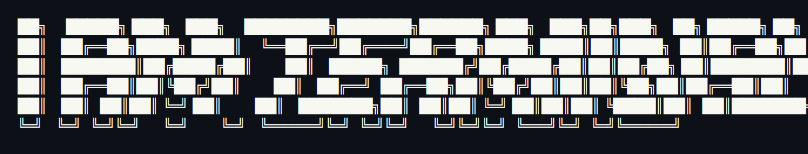

<div align="center">

<p align="center">
  
</p>


</div>

<br>

```bash
visitor@github:~$ whoami
Mohammadreza Abed
```

> "I learned very early the difference between knowing the name of something and knowing something."

```bash
visitor@github:~$ fastfetch
```

```text
              Mohammadreza@github
---------------------------------------------
OS           Ubuntu Linux
Shell        zsh
Editor       VS Code, IntelliJ IDEA
Languages    Java, Python
Learning     Spring Boot
Current      ResumeForge
              Metro Route Finder
Goal         Build software people actually use
```

<br>

<div align="center">

### `> stack --list`


</div>

<br>

```bash
visitor@github:~$ ls ~/projects
```

<div align="center">

<table>
<tr>
<td width="50%">

**`ResumeForge/`**
_- Generate beautiful resumes from JSON with multiple themes._
[`→ open`](https://github.com/MohammadrezaTheFirst/ResumeForge)

</td>

</tr>
</table>

</div>

<br>

```bash
visitor@github:~$ mission
```

```text
Current focus

• Learning Java deeply
• Building backend projects
• Exploring Linux
• Open to collaboration
```

<div align="center">

### `> stats --render`


</div>

<br>


```bash
visitor@github:~$ git remote -v
```

<div align="center">


**[`github.com/MohammadrezaTheFirst`](https://github.com/MohammadrezaTheFirst)**

</div>

<br>

<div align="center">

_
visitor@github:~$ exit

logout
Connection to github closed._


</div>
